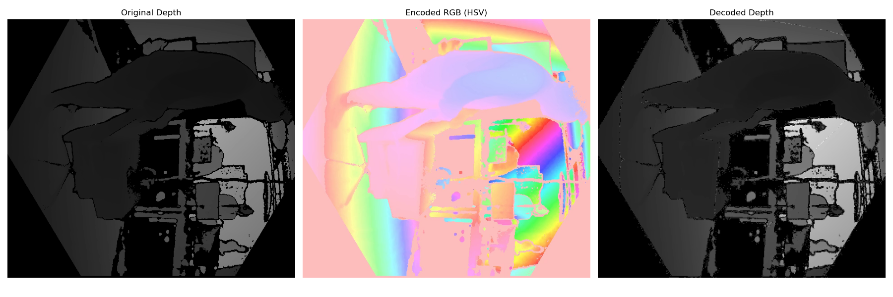
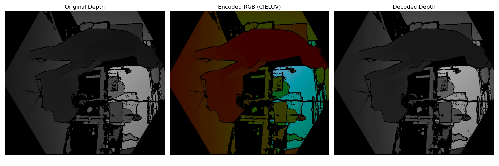
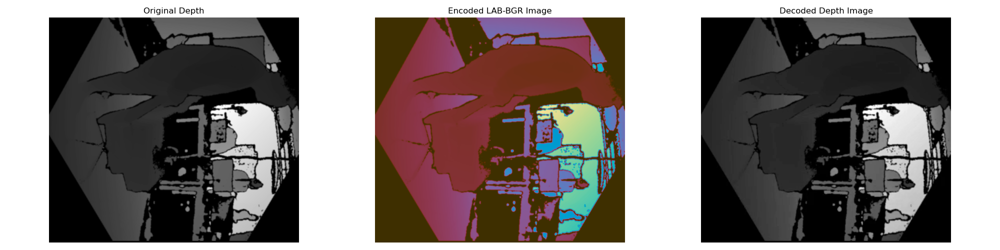
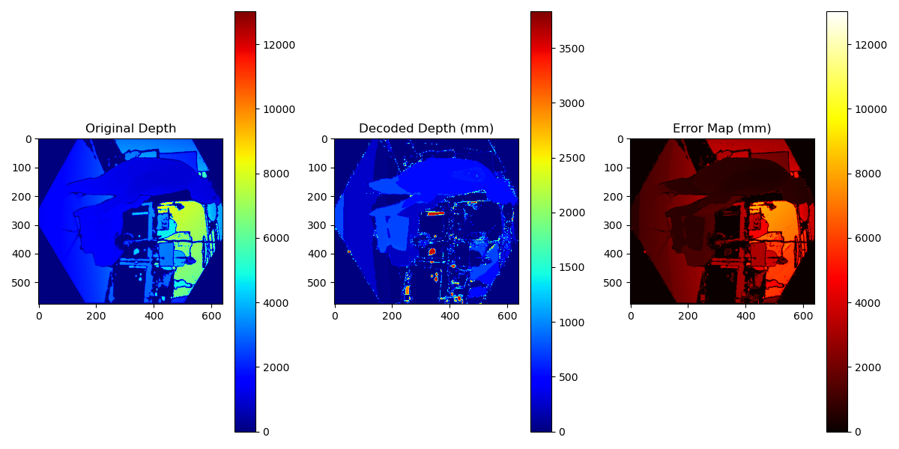
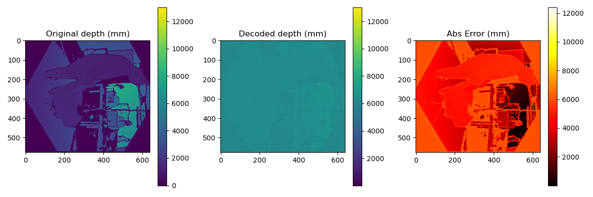
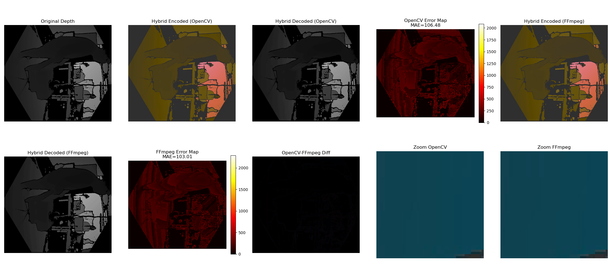

# Depth-to-Color Encoding Methods

This project implements multiple methods to encode depth maps (z-values) into RGB images using different color spaces and techniques. These encodings enable efficient compression of depth data with common video codecs.

---

## Files & Methods Overview

| Script Name           | Encoding Method    | Description                                  |
|-----------------------|--------------------|----------------------------------------------|
| `depth_hsv_rgb.py`    | HSV-RGB            | Encode depth using HSV color mapping.        |
| `depth_luv_rgb.py`    | CIELUV-RGB         | Encode depth in perceptually uniform LUV.   |
| `depth_lab_rgb.py`    | CIELAB-RGB         | Encode depth in perceptually uniform LAB.   |
| `depth_mvd_roi.py`    | MVD + ROI          | Motion vector displacement + ROI encoding.  |
| `depth_n_depth.py`    | N-Depth            | Nonlinear depth quantization method.         |
| `read_depth_methods.py` | Launcher          | Runs all above methods on `zvalues.txt`.     |
| `zvalues.txt`         | Input depth file   | Plain text file with depth values.            |

---

## Prerequisites

Install required Python packages:

```bash
pip install numpy opencv-python
```

## Run for Method 1 (depth_hsv_rgb.py)

```bash
python read_depth_methods.py 
```
and enter 1. When you run the first method, the following output files are generated:

- A preview image:



- Two PLY files saved in the `ply_output` folder:
- [frame_000000_decoded.ply](ply_output/frame_000000_decoded.ply)
- [frame_000000_original.ply](ply_output/frame_000000_original.ply)


> To view these `.ply` files, please open them with a 3D viewer such as [MeshLab](https://www.meshlab.net/) or [CloudCompare](https://www.danielgm.net/cc/).


## Run for Method 2 (depth_luv_rgb.py)

```bash
python read_depth_methods.py 
```
and enter 2. When you run the first method, the following output files are generated:

- A preview image:



- Two PLY files saved in the `ply_output` folder:
- [frame_000000_decoded.ply](frame_000000_decoded.ply)
- [frame_000000_original.ply](frame_000000_original.ply)


## Run for Method 3 (depth_lab_rgb.py)

```bash
python read_depth_methods.py 
```
and enter 3. When you run the first method, the following output files are generated:

- A preview image:



- Two PLY files saved in the `ply_output` folder:
- [frame_000000_decoded.ply](decoded_depth.ply)
- [frame_000000_original.ply](encoded_lab_color.ply)

## Run for Method 4 (depth_mvd_roi.py)

```bash
python read_depth_methods.py 
```
and enter 4. When you run the first method, the following output files are generated:

- A preview image:



- Two PLY files saved in the `ply_output` folder:
- [frame_000000_decoded.ply](decoded_cloud.ply)
- [frame_000000_original.ply](encoded_cloud.ply)

## Run for Method 5 (depth_n_depth.py)

```bash
python read_depth_methods.py 
```
- When prompted, enter 5 to select method 5. It will then ask for:
:::Number of epochs (default is 10)
:::Batch size (default is 4) 

- When you run the first method, the following output files are generated:

- A preview image:



## Run for Method 6 (depth_hybrid_lab_hsv.py)

```bash
python read_depth_methods.py 
```
and enter 6. When you run the first method, the following output files are generated:

- A preview image:



- Two PLY files saved in the `ply_output` folder: 
- [frame_000000_decoded.ply](decoded_ffmpeg_000.ply) – decoded using FFmpeg
- [frame_000000_original.ply](decoded_opencv_000.ply)– decoded using OpenCV